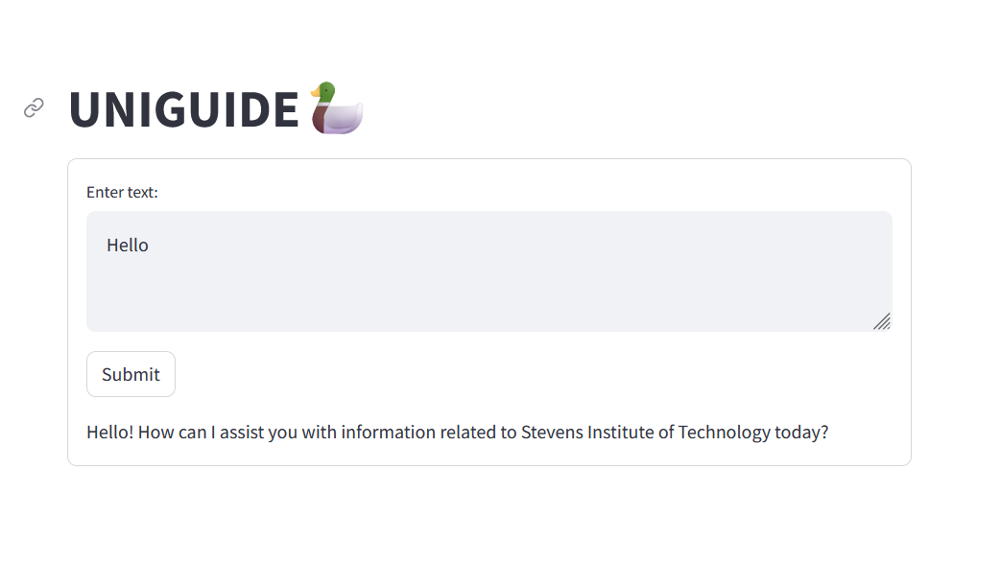

# Stevens Institute of Technology Chatbot

Welcome to the repository for the Stevens Institute of Technology Chatbot. This chatbot is designed to assist students, faculty, and prospective applicants by providing detailed information about various aspects of university life and administration at Stevens Institute of Technology. Built using Langchain, Streamlit, and GPT-4, this chatbot offers a user-friendly interface and comprehensive details across a range of topics.

## Features

The chatbot includes information on the following topics:

- **Financing a Stevens Education**: Offers information on financing sources, institutional programs, financial aid, and state financing options to help students manage their education expenses.

- **Tuition Fees and Expenses**: Separate details for undergraduate and graduate students covering all aspects of tuition, fees, and other related expenses.

- **Student Life at Stevens**: Insights into student services, sports, code of conduct, and student government bodies that enrich the campus experience.

- **Student Services at Stevens**: Information on academic tutoring, career guidance, counseling, disability accommodations, financial aid management, health services, and housing options.

- **Graduate Education at Stevens**: Details on admissions, course options, grading policies, English proficiency support, and academic progression for graduate students.

- **Undergraduate Education at Stevens**: Similar guidance for undergraduate admissions, course structure, grading, and progression.

- **Program Information at Stevens**: In-depth details on undergraduate and graduate programs including course structures for bachelor's, master's, PhD, and engineering programs.

- **Off Campus Employment**: Information about employment options for students on various visas, focusing on off-campus opportunities.

- **Course Information**: Specific details about individual courses, including credit counts and course descriptions.

## Usage

To interact with the chatbot, simply run the Streamlit application and choose the topic you are interested in from the main menu. The chatbot will guide you through the available information and answer any specific queries you may have.

## Installation
The code has been built on python==3.11.5   
Ensure you store the OPENAI_API_KEY  in an environment variable

1. Clone this repository
2. Install the required dependencies using `pip install -r requirements.txt`
3. Upload all the data to the ChromaDB using `notebooks/chromadb_upload.ipynb`
3. Run the Streamlit app `streamlit run main.py`. If you want to run in notebook use `e2e.ipynb`

Thank you for visiting and using the Stevens Institute of Technology Chatbot!